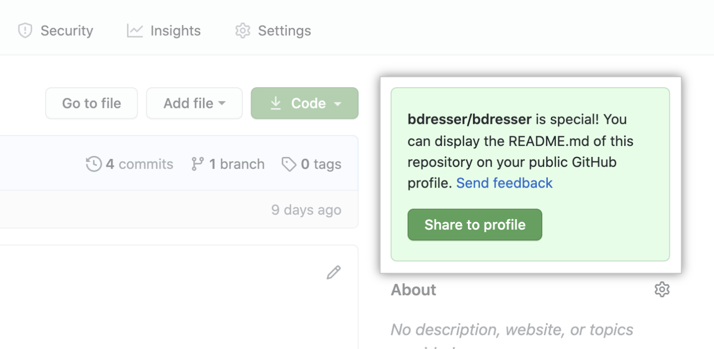
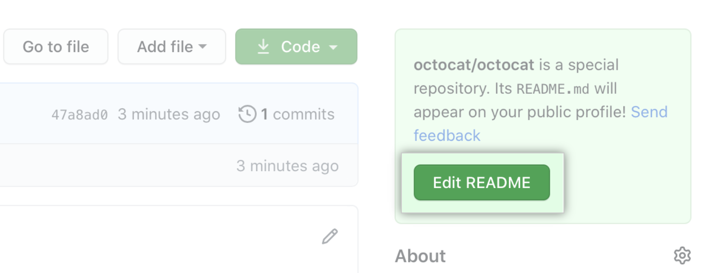
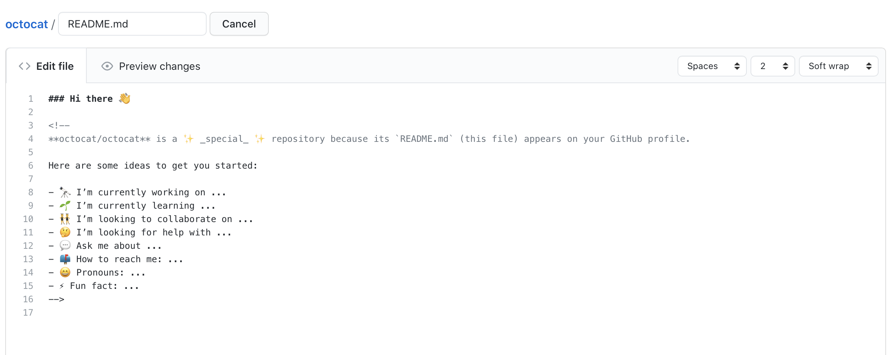

Lab: Managing your profile README
=================================

You can add a README to your GitHub profile to tell other people about
yourself.

About your profile README
--------------------------

You can share information about yourself with the community on
GitHub.com by creating a profile README. GitHub shows your profile
README at the top of your profile page.

You decide what information to include in your profile README, so you
have full control over how you present yourself on GitHub. Here are some
examples of information that visitors may find interesting, fun, or
useful in your profile README.

-   An \"About me\" section that describes your work and interests
-   Contributions you\'re proud of, and context about those
    contributions
-   Guidance for getting help in communities where you\'re involved

You can format text and include emoji, images, and GIFs in your profile
README by using GitHub Flavored Markdown.

Prerequisites
-------------

GitHub will display your profile README on your profile page if all of
the following are true.

-   You\'ve created a repository with a name that matches your GitHub
    username.
-   The repository is public.
-   The repository contains a file named README.md in its root.
-   The README.md file contains any content.

**Note**: If you created a public repository with the same name as your
username before July 2020, GitHub won\'t automatically show the
repository\'s README on your profile. You can manually share the
repository\'s README to your profile by going to the repository on
GitHub.com and clicking **Share to profile**.

Adding a profile README
------------------------

1.  In the upper-right corner of any page, use the drop-down menu, and
    select **New repository**. 
    
    

2.  Under \"Repository name\", type a repository name that matches your
    GitHub username. For example, if your username is \"octocat\", the
    repository name must be \"octocat\". 

    

3.  Optionally, add a description of your repository. For example, \"My
    personal repository.\" 

    

4.  Select **Public**. 

    

5.  Select **Initialize this repository with a README**. 
    
    

6.  Click **Create repository**. 
    

7.  Above the right sidebar, click **Edit README**. 

    

    The generated README file is pre-populated with a template to give
    you some inspiration for your profile README. 
    
    

For a summary of all the available emojis and their codes, see \"[Emoji
cheat sheet](https://www.webfx.com/tools/emoji-cheat-sheet/).\"

Removing a profile README
-------------------------

The profile README is removed from your GitHub profile if any of the
following apply:

-   The README file is empty or doesn\'t exist.
-   The repository is private.
-   The repository name no longer matches your username.
